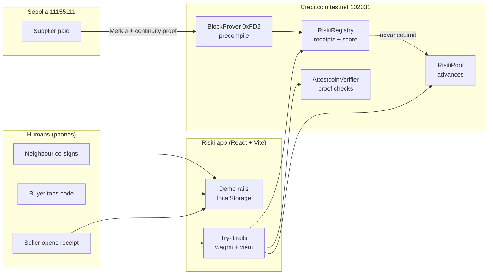
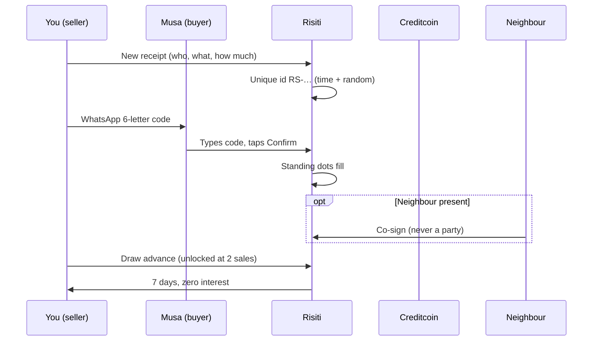
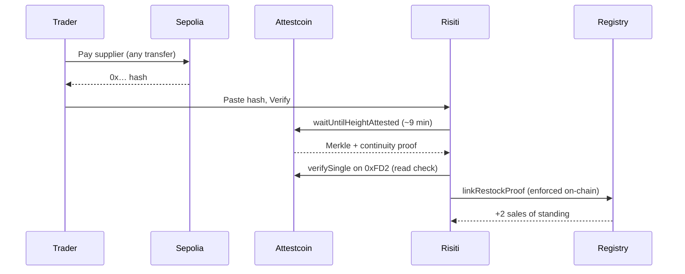

# Risiti — market receipts become on-chain credit

*Risiti* is Swahili for *receipt*. Built for **BUIDL CTC 2026 Fall (DeFi + RWA)** on Creditcoin.

Credit for traders with **zero on-chain history**: sell → buyer taps confirm → neighbour
co-signs → standing unlocks a zero-interest community advance. Supplier restocks paid on
Sepolia are proven on Creditcoin through the **Attestcoin Protocol** (BlockProver `0xFD2`).

One line: **credit manufactured from a tomato sale.** Built in Nigerian markets first; works in any informal market on earth.

---

## 1. System overview



**Money never moves inside Risiti.** Cash, transfers, crypto all happen outside; the app is
the witness. Demo rails run fully offline on the phone. Try-it rails sign real testnet
transactions. The two never share state.

## 2. Architecture

| Layer | What lives here | Source of truth |
|---|---|---|
| Screens (5 tabs) | Onboarding, Home, Market, New, Bills, Score | — |
| Demo store | Receipts, stalls, voices, score math | `localStorage` (this phone) |
| Chain feed | Registry receipts, pot, limits, scores, voices | Creditcoin testnet (every phone) |
| Contracts | Registry, Pool, Verifier | Deployed bytecode + Blockscout |
| Proofs (core — every boost moves score and limits) | Sepolia tx → attestation → `0xFD2` verify → enforced inside `linkRestockProof` | Attestcoin Protocol |

### Screen map

- **Onboarding** (once): welcome → how standing grows → your name → your stall (optional).
- **Home:** cinematic hero, standing tiers, market, voices, why-it-matters, FAQ.
- **Market:** stalls across Mile 12 Lagos, Onitsha, Kano, Ibadan, Kibera Nairobi, Makola
  Accra — filter by market, tap a stall to start its receipt, add your own stall.
- **New:** sale vs restock tabs, buyer/supplier, goods, amount + global currency picker,
  photo picker (no camera needed).
- **Bills:** buyer code box, receipt cards, share-by-WhatsApp, masked codes, no-phone path.
- **Score:** standing journey, community pot (demo + on-chain), Boost (verified top-ups),
  bank statement print, voices (local + on-chain).

## 3. Core flows

### 3.1 Sale → confirm → advance (the 90-second loop)



### 3.2 Supplier restock → verified boost (Attestcoin)



Paid cash or transfer instead? Record it as a supplier receipt — the supplier confirms
(or a neighbour stands in for a no-phone supplier). Same machinery, zero crypto needed.

### 3.3 No-phone buyer

Buyer has no device → seller marks the sale no-phone → a neighbour confirms for them on
the spot. On-chain twin: `confirmVerbal` (third-party rule enforced in code).

## 4. Standing math (same on phone and chain)

```
score = 300 + min(confirmed × 50, 500) + min(volume ÷ 0.05, 60)
        + co-signs × 8 + verified top-ups × 12 − defaults × 120
clamped to 300..900

Chama rule: one default revokes further advances (`defaults > 0` → limit 0).
```

| Score | Advance |
|---|---|
| 750+ | 5 tCTC |
| 620+ | 2 tCTC |
| 500+ | 1 tCTC |
| 400+ | 0.4 tCTC |
| below | build first |

Two sales unlock the first advance: 300 + 100 = 400 on the dot. The top tier additionally
requires 1 verified restock — the protocol guards the biggest money.

## 5. Anti-fraud rules

| Attack | Defense |
|---|---|
| Sell to yourself | Same-name sales need a witness to count (app); self-addresses rejected on-chain |
| Sign your own receipt | Parties can never confirm, witness, or stand in — UI + contract |
| Two Musas, one name | Unique faces per receipt, market labels, same-name sales need a witness to count |
| Wash-trading with a friend | Max 3 counted sales per counterparty |
| Replay a proof | `proofUsed` guard — one proof boosts once |
| Fake top-up | Only real Sepolia transfers verify; cash path needs a human confirmer |
| Grinding a fortune | Advances start at 0.4 tCTC for 7 days — attacks cost more than they earn |

Residual honesty: two determined phones can grind slowly. Size, witnesses, and human
bank review contain it. No cheap system stops that — ours makes it unprofitable.

## 6. Contracts (Creditcoin testnet `102031`)

| Contract | Purpose | Key functions |
|---|---|---|
| `RisitiRegistry` | Receipts, score, proofs, voices | `openRisiti`, `confirmRisiti`, `witnessRisiti`, `confirmVerbal`, `linkRestockProof`, `addVoice`, `trustScore`, `advanceLimit` |
| `RisitiPool` | Community money | `fund`, `draw`, `repay`, `pot` |
| `AttestcoinVerifier` | Standalone proof checks | `verifyAndTag` |

Live addresses land in `.env` after deploy (`VITE_REGISTRY`, `VITE_POOL`, `VITE_VERIFIER`)
and render as Blockscout pills in the app's Why band. The precompile interface matches
the installed `@gluwa/usc-sdk` block-prover ABI exactly
(`verify(uint64,uint64,bytes,tuple,tuple)`), verified against `node_modules` — never
guessed.

## 7. Modes (quarantined)

| | Demo | Try-it |
|---|---|---|
| Wallet | never connected (auto-disconnects) | required, testnet only |
| Receipts/scores/pot | this phone | the chain |
| Money | play numbers | real tCTC signatures |
| Proofs | instant local marks | ~9 min attestation + submit |

Switching to Demo disconnects the wallet. Nothing crosses the wall.

## 8. Run it (zero cost)

```bash
npm install
npm run dev          # Demo: instant, no wallet
```

Try-it: add Creditcoin Testnet (chain `102031`, RPC
`https://rpc.cc3-testnet.creditcoin.network`), fund via Discord `#token-faucet`
(`/faucet address:0x…`), deploy (`node scripts/deploy.cjs` with a burner `DEPLOYER_KEY`),
restart dev. Sepolia ETH for proofs: `sepolia-faucet.pk910.de` (no account, no gate).

Free faucets only — the whole submission costs nothing.

## 9. Docs

- `docs/ATTESTCOIN.md` — required technical integration doc.
- `contracts/README.md` — testnet deploy guide.
- Sectors: **DeFi + RWA**.

## 10. Credits

Unsplash (market photography), DiceBear (avatars), Heroicons (icons only — no other
icon set), `motion` (animation), wagmi + viem (chain), `@gluwa/usc-sdk` + ethers
(proofs). Fonts: system stacks. No emojis anywhere.
